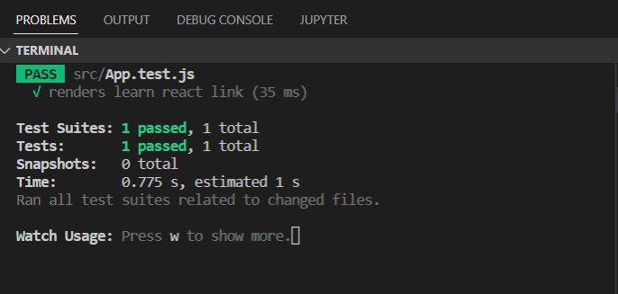

# Joyfull Jasper Week 6

# React - Redux

## Introduction Redux

Redux adalah salah satu library state managemenPt yang biasa disandingkan dengan react. Tujuanya adalah menyimpan state di satu tempat, sehingga lebih mudah untuk di manage. Redux juga menawarkan tools untuk masing-masing browser contoh chrome redux devtools untuk memonitor keadaan state kita saat ini. Package middleware-nya juga sudah banyak di kembangkan gratis dan siap digunakan untuk memudahkan kita mengembangkan aplikasi yang kita sedang kerjakan.

## Cara Bekerja


1. **UI** : Tampilan Aplikasi
2. **Action** : Sebuah function yang me-_return_ sebuah objek. Objek tersebut memiliki sebuah property wajib yaitu type. Type inilah yang menentukan bagaimana statenya akan diubah.
3. **Reducer** : Adalah sebuah fungsi yang tugasnya untuk mengolah state yang ada di store. Misal menambah data, menghapus data, mengambil data, dsb.
4. **Store** : Store adalah tempat untuk menampung state. Jadi store ibarat database untuk frontend.

## Setup Redux

Instal Redux

```
npm install @reduxjs/toolkit react-redux
```

### 1. Membuat store dan koneksikan ke aplikasi react kita

- Import provider dari react redux dan masukan store ke dalam provider, di file index.js bungkus providernya

```
import { Provider } from "react-redux";
//untuk akses store
import store from "./store";

//render provider
<Provider store={store}>
      <App />
</Provider>
```

- Membuat store dengan menggunakan configure store, pertama buat folder store di dalam folder src. Kemudian tambahkan file index.js.

```
import { configureStore } from "@reduxjs/toolkit";
//akses book reducer
import bookReducer from "../Components/Books/BookSlice";
const store = configureStore({
  reducer: {
    tes: "test",
    book: bookReducer
  },
});

export default store;

```

- import store masuk ke provider, di file index.js

```
import store from "./store";
```

### 2. Buat komponen Slice dan View

contoh :
buat folder baru di folder components, dengan nama Books yang berisikan BookSlice.js dan BookView.js

Di file App.js jangan lupa import viewnya, lalu panggil BookView nya

```
import BooksView from "./Components/Books/BooksView";
//Panggil BookView
<BooksView />
```

- View hanya berisi teks aja

```
import React from 'react';
const BookView =()=> {
  return(
    <div>BookView</div>
  )
}

exprot default BookView;
```

- BooksSlice berisi createSlice untuk reducer yang dikirim ke store

```
import { createSlice } from "@reduxjs/toolkit";

const initialState = {
  totalBooks: 100,
};

const bookSlice = createSlice({
  name: "book",
  initialState,
  //reducers
  reducers: {
    //action borow
    borrow: (state) => {
      state.totalBooks--;
    },
  },
});

export default bookSlice.reducer;
export const { borrow } = bookSlice.actions;
```

- Store menerima createSlice dari BooksSlice,

```
import bookReducer from "../Components/Books/BookSlice";
```

### 3. Memunculkan state dari store redux

Menggunakan useSelector dalam komponen view

```
import { useSelector } from "react-redux";

const BooksView = () => {
  const totalBooksRedux = useSelector((state) => state.book.totalBooks);

  console.log("total :", totalBooksRedux);
  return (
    <div>
      <h3>Total Book : {totalBooksRedux}</h3>
    </div>
  );
};

export default BooksView;

```

### 4. Mengubah state dari store redux menggunakan action

Export action dari bookSlice
Buat button untuk melakukan useDispatch action

```
import { useSelector, useDispatch } from "react-redux";
import { borrow } from "./BookSlice";

const BooksView = () => {
  const dispatch = useDispatch();
  const totalBooksRedux = useSelector((state) => state.book.totalBooks);

  console.log("total :", totalBooksRedux);
  return (
    <div>
      <h1>BooksView</h1>
      <h3>Total Book : {totalBooksRedux}</h3>
      <button onClick={() => dispatch(borrow())}>borow</button>
    </div>
  );
};

export default BooksView;

```

## React Context

- Salah satu state management bawaan React JS
- variable global yang bisa akses dimana saja tanpa harus memparsing props ke setiap komponen.
- Tidak perlu instal apapun.

### Setup UseContext

- Buat folder baru context, untuk menampung isi contextnya, dan didalam folder tersebut isi dengan file baru. contohnya UserContext.js

```
import { useState, createContext, } from "react";

// buat dulu setup context dengan createContext
export const UserContext = createContext();

// komponen provider untuk menyediakan si data context
const UserContextProvider = (props) => {
  const [user] = useState({
    name: "skilvul",
    batch: "Joyfull Jasper",
  });

  return (
    //provider digunakan untuk mengirim data ke consumer
    <UserContext.Provider value={{ user, userData }}>
      {props.children}
    </UserContext.Provider>
  );
};
export default UserContextProvider;

```

- Kemudian untuk komponennya kita buat folder component yg berisi User.js yang menerima data dari contextnya

```
import { UserContext } from "../context/UserContext";

const User = () => {
  return (
    <UserContext.Consumer>
      {(userContext) => {
        const { user } = userContext;
        const { userData } = userContext;
        console.log(userData);
        return (
          <div>
            <h1>User Context</h1>
            <h3>Name: {user.name}</h3>
            <h3>batch: {user.batch}</h3>
          </div>
        );
      }}
    </UserContext.Consumer>
  );
};

export default User;

```

- Untuk menampilkan outputnya Di App.js kita panggil usernya

```
import "./App.css";
import User from "./components/User";import UserContextProvider from "./context/UserContext";

function App() {
  return (
    <div className="App">
      <UserContextProvider>
        <User />
      </UserContextProvider>
    </div>
  );
}

export default App;

```

note : **hooks => useState, useState, useEffect. dll**

## Bootstrap di React JS

Instal bootstrap di project React kita untuk menggunakan react-bootstrap

```
npm install react-bootstrap bootstrap
```

### Setup React-Bootstrap

```
// import css bootstrap

import 'bootstrap/dist/css/bootstrap.min.css';
```

di file index.js

### Components React-Bootstrap

Tombol / Button

```
import Button from 'react-bootstrap/Button';
//atau
import {Button} from 'react-bootstrap';

function TypesExample() {
  return (
    <>
      <Button variant="primary">Primary</Button>
    </>
  );
}

export default TypesExample;
```

info lebih lanjut
https://react-bootstrap.netlify.app/components/alerts

## React Testing

Testing React di gunakan untuk tes komponen di react,
perintah untuk melakukan test react

```
npm run test
```

Pada react testing sebenarnya sudah ada unit testing bawaanya. di file App.test.js

```
import { render, screen } from '@testing-library/react';
import App from './App';

test('renders learn react link', () => {
  render(<App />);
  const linkElement = screen.getByText(/learn react/i);
  expect(linkElement).toBeInTheDocument();
});

```



testing yg digunakan untuk mengecek tulisan "learn react", jika tulisan reactnya kita hapus pada unit testnya akan eror tetapi aplikasinya tetap berjalan.


